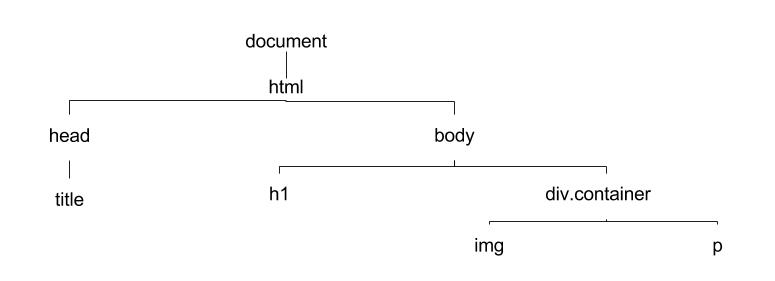

# Objects in JavaScript: A Pragmatic Approach

This chapter will introduce you to JavaScript objects. Objects allow a programmer to store and quickly retrieve data. They are a fundamental part of the JavaScript programming language. Before we begin I would like to define two terms I will make use of throughout this chapter: **expression** and **value**. An expression is an instruction for a computer to execute. Once an expression is run (i.e., it is compiled) it becomes a value.

```js
// the function four is initially an expression - it is an instruction
// that is not yet evaluated

function four() {
  return 4
}

//the variable theNumberFour is now equal to the value of 4

var theNumberFour = four() //=> returns the value 4
```

## Building an Object

An object is a collection of [key-value](http://searchenterprisedesktop.techtarget.com/definition/key-value-pair) pairs separated by commas. The keys are called **properties** and the values are called **values**. Go figure. Here is an empty object:

```js
var obj = {}
```

Let's say we wanted to create an object to hold the name and age of our 3 favorite friends:

  1. Jose who is 45 years old
  2. Shelly who is 4 years old
  3. Steve who is 47 years old

Let's create an object that holds this data:

```js
var myFriends = {"Jose": 45, "Shelly":  4, "Steve": 47}
```

##### Accessing Properties on an Object

If I want to access the age of Jose from my object I would do this:

```js
myFriends.Jose  //=> evaluates to 45
myFriends["Jose"] //=> evaluates to 45
```

You just saw the two ways of accessing a value on an object:
  1. **Dot notation** - using a `.`
  2. **Bracket notation** - using `[]`

Bracket and dot notation both retrieve values from an object. They are just 2 different syntaxes for accomplishing the same thing. Dot notation does have some limitations though. I recommend you always use dot notation because it requires fewer characters to type. The only situations where you should use bracket notation are when:

1. the property name is contained in a variable
2. the property name contains a space or dash

```js
// property name is contained in a variable

var wantA = true
var myObject = {
	a: 2
}

var idx

if (wantA) {
	idx = "a"
}

console.log(myObject[idx]) //=> 2
console.log(myObject.idx)//=> undefined

// property name contains a space

var me = {"my name": "Jon"}

me.my name //=> Uncaught Syntax Error
me["my name"] //=> "Jon"
```

##### Deleting and Adding Properties

To delete a property-value pair from an object use the `delete` operator:

```js
var obj = {"a": "b"}
delete obj.a
console.log(obj) //=> {}
```

To add a property to an object you can simply use dot or bracket notation:

```js
var newObj = {}

newObj.a = "cats"
newObj["food"] = "yummy"

console.log(newObj) //=> {a: "cats", food: "yummy"}
```

##### Interrogating an Object

Remember that JavaScript has six primitive data types:

* string
* number
* boolean
* null
* undefined
* object

Every value or expression in JavaScript is either:
* one of these data types, or
* derived from these data types

Sometimes it's useful to know the type of data you are working with. JavaScript has a useful operator named
`typeof` which you can use to determine the type of value you are working with.

```js
var me = {}
typeof me //=> returns "object"
```

##### Methods

You can add functions to objects and later invoke them:

```js
const foo = {
  "name": "Jon",
  hello: function() {
    return "hello"
  }
}

foo.hello() //=> "hello"
```

You may also want the function to do something using the data from an object. This is where using `this` may come in handy:

```js
var cats = {
	sound: "meow",
  makeSound: function() {
  	console.log(`Cats go ${this.sound}`)
  }
}

console.log(cats.makeSound()) //=> Cats go meow
```

`this` refers to the current object. So in this example `this` refers to the `cats` object. This makes sense because `this.sound` evaluated to "meow".

##### Iterating Through an Object

To iterate through an object use the `for...in` syntax:

```js
var obj = {0: "first", 1: "second"}

for (var key in obj) {
  console.log(obj[key])
 }

 // This returns first then on the next line second
```

Note that we *had* to use bracket notation here because key is a variable that must be evaluated before property lookup.

##### Constructors

A *constructor* is a general computer science term. A constructor is simply a function that creates (or returns) an object. Here is an example of a constructor in JavaScript:

```js

function constructMe(name, age) {
  return {
    myName: name,
    myAge: age
  }
}

console.log(constructMe("Jon", 23)) //=> {name: "Jon", age: 23}
```

##### Object Equality

You can think of each object being stored in a unique spot in memory. Therefore any two objects are not equal to one another even if they have identical key-value pairings:

```js
var one = {foo: 'foo'}
var two = {foo: 'foo'}

one === two //=> false
```
## The Document Object Model

The DOM or Document Object Model is an abstract representation of a web page. It represents a web page as a [tree](https://en.wikipedia.org/wiki/Tree_(data_structure)). The root element of this tree is referred to as the `document`. Consider the `html` document.

```html
<!doctype html>
<html>
<head>
  <title>Learning the DOM</title>
</head>
<body>
  <h1>Title</h1>
  <div class="container">
    
    <p>Text</p>
  </div>
</body>
</html>
```

When this document is rendered by a web browser the web browser creates an in-memory model that looks something like this:



This in-memory model is the browser's implementation of the abstract Document Object Model. All major browser vendors have coded an implementation of the Document Object Model into their browsers. From this point on when I refer to the "DOM" I am really referring to the implementation of the Document Object Model that exists in all major web browsers. This implementation includes a JavaScript interface that allows us to *manipulate* the DOM.

If we open up the "Console" panel on the Chrome DevTools and type,

```js
document
```
we get a JavaScript object returned. This is because each node on the DOM is really just a JavaScript object with properties and values. Let's explore some of `document`'s properties:

```js
document.children
```

You can see that document has a `children` property with a value of `html`. To see the actual HTML of the web page type in:

```js
document.children[0]
```
